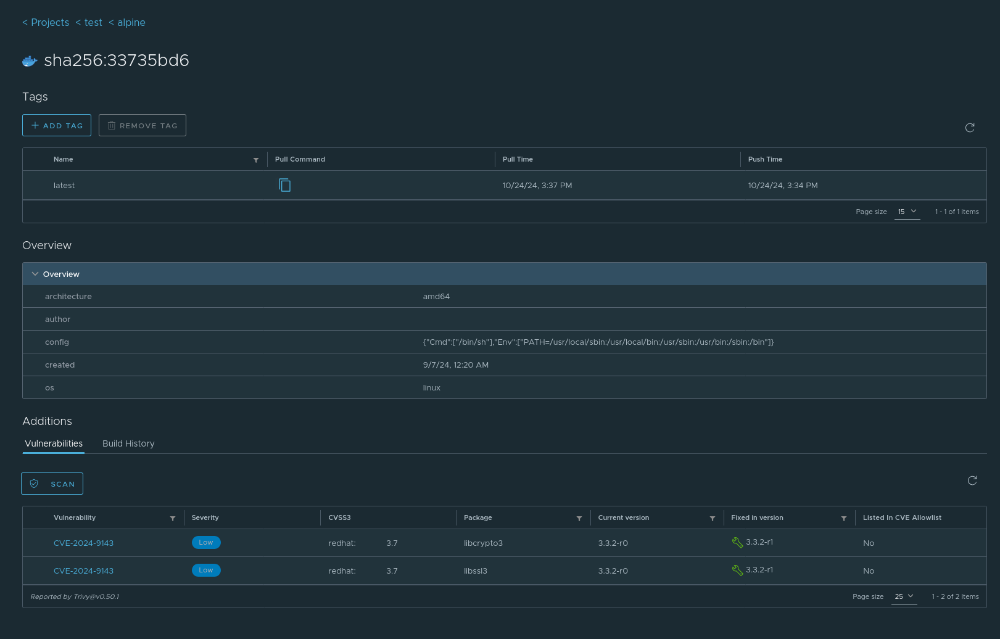

# Analyse et scan de vulnérabilité

Comment afficher les infos sur la sécurité de vos conteneurs.

## Utilisation de Trivy avec l'interface Harbor

Connectez vous sur CSAN et rendez-vous dans votre dépot. Vous pouvez lancer un scan Trivy sur chaque image et visualiser les résultats dans l'interface graphique.

